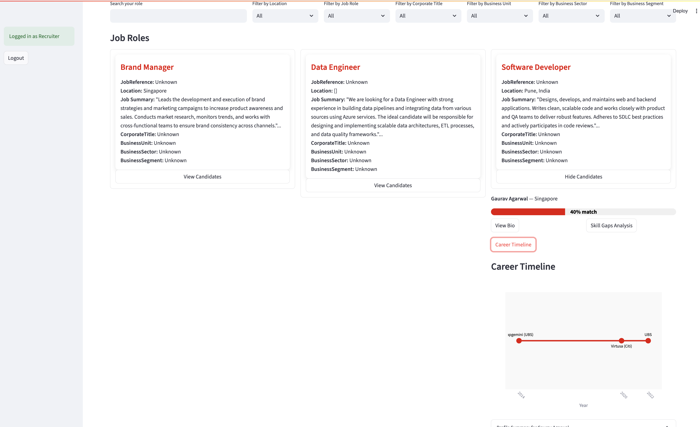

## Matchly is an app designed to make tailor made recommendations for recruiters and candidates to get the best suited profiles of job seekers and the job itself.

# Tech stack used

Azure AI Search

Azure OpenAI

Streamlit

Python

# Do not forget to load these env variables

OPENAI_ENDPOINT_URL=

AZUREOPEN_AI_DEPLOYMENT_NAME = gpt-4o

AZURE_OPENAI_API_KEY=

AZURE_AI_SEARCH_API_KEY=

AZURE_AI_SEARCH_ENDPOINT=

AZURE_AI_SEARCH_INDEX_NAME=resume-index

GPT_API_VERSION=2025-01-01-preview

AZURE_AI_SEARCH_INDEX_NAME_JD=jd-index

Get your own keys and create a .env file to keep the keys and endpoint

# Look and feel of the Recruiter

### Recruiter Login Page:

### Recruiter NLP chatbot recommendation:

# Look and feel of the Candidate

### Candidate Login Page:

### Candidate NLP chatbot recommendation:

# Architecture

###  Note: Delete your resources from Azure once work is done 

